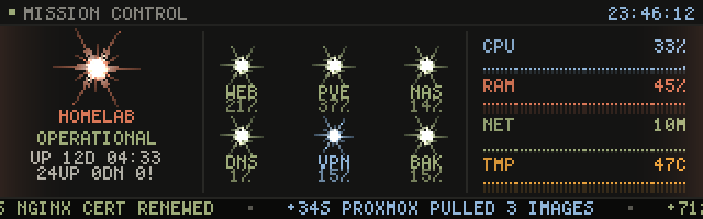
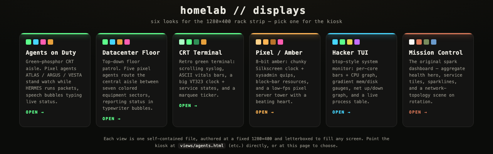
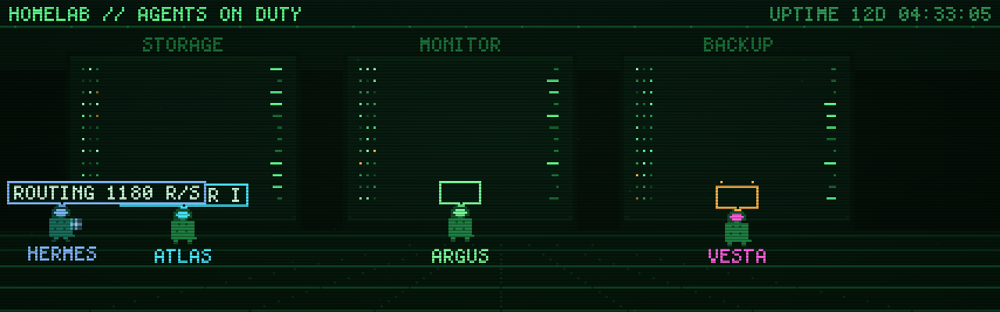
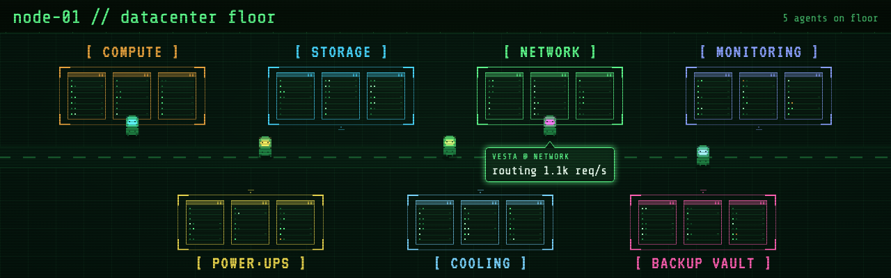
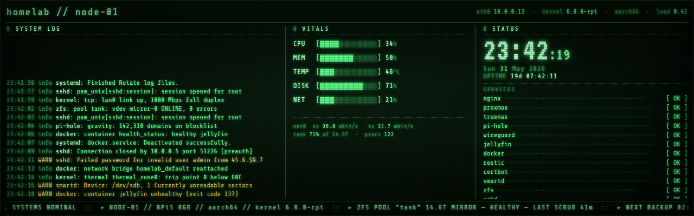
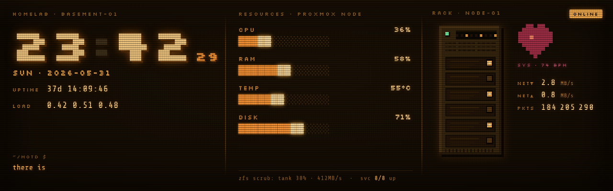
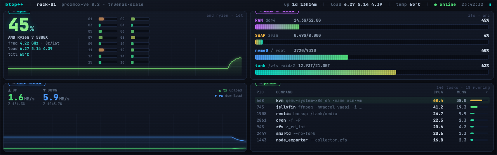

# Homelab Pixel Strip

> A glowing **pixel-art status display** for a homelab — built for an ultra-wide **2U rack strip**
> (the GeeekPi 7.84″ **1280×400**, 3.2:1). Zero dependencies, no build step, runs forever in a
> browser or kiosk. Inspired by the animated Claude Code icon — the warm Anthropic "spark."



A Raspberry Pi drives a thin, wide monitor bolted to a server rack; **this repo is what's on the
screen.** It's a collection of **self-contained HTML displays** — a primary **spark dashboard** plus
a gallery of alternate **pixel-art themes** — all driven by mocked data that drifts realistically, so
the strip always looks alive. Point the kiosk at whichever look you like.

- 🖥️ **Built for 1280×400** — every display is authored at that exact size and letterboxes to fill any screen.
- 🎨 **Pure pixel art** — CRT phosphor, chunky sprites, bitmap & retro web fonts, `image-rendering: pixelated`.
- ⚡ **Zero deps / no build** — plain HTML5 Canvas + vanilla JS. Open a file and it runs.
- 🔌 **Mocked now, real-data ready** — one clean seam swaps the simulator for live metrics (Uptime Kuma, ntfy, Prometheus…).
- ♾️ **Runs forever** — smooth on a Pi, no memory growth, no end state, no interaction required.

---

## The dashboard — `index.html`

The main view (pictured above). Two scenes **auto-rotate** (~11s each) with a smooth dissolve:

- **Mission Control** — an aggregate health hero (`OPERATIONAL` / `DEGRADED` / `CRITICAL`) with
  uptime + counts, a 3×2 grid of **service tiles** (spark + label + metric), and four live **metric
  sparklines** (CPU / RAM / NET / TMP).
- **Network Topology** — services as **linked spark nodes** (NET → SW → services) with **traffic
  dots** flowing along the links, each glowing in its state colour.

A status dot + title + clock header, a colour-coded **event ticker**, and an ambient **edge-glow**
tinted by overall health sit on top. A **critical event takes over the whole strip** (a red
strobe/shake) then returns to the rotation. Everything reads one store (`src/dash/data.js`), driven
by a simulator that loops **healthy → degrade → critical → recover**.

> **Controls:** keys **`1`** / **`2`** jump between scenes · **`0`** fires a test alert · console:
> `Dash.view(0|1)`, `Dash.alert('your message')`.

---

## Themed views — `views/`

Five extra **single-file, self-contained** displays — same 1280×400 strip, each its own little
world, all data mocked and drifting forever (~7/10 motion). Browse them with the picker at
**`views/index.html`**, or point the kiosk straight at one. Unlike the dashboard, these **don't** use
the `src/` engine — each is one standalone file; the only external link is Google Fonts (with
monospace fallbacks so they still read offline).



### 🟢 Agents on Duty — `views/agents.html`

A green-phosphor CRT server aisle. Little hooded **pixel agents** — ATLAS (storage), ARGUS
(monitoring), VESTA (backups) — stand watch at their racks while **HERMES** runs a glowing packet up
and down the floor in a 2-frame walk. Each types out a live status line in a speech bubble, with the
occasional amber `WARN`.



### 🟢 Datacenter Floor — `views/datacenter.html`

A top-down companion to *Agents*. **Five agents autonomously patrol** the central aisle between
**seven colour-coded equipment sectors** (compute · storage · network · monitoring · power · cooling
· backup), fanning out so no two crowd the same zone, then reporting `NAME @ SECTOR` + a status line
on arrival. Detailed server cabinets with blinking LEDs, glowing-visor sprites, two-line bubbles —
the highest-fidelity view in the set.



### 🟢 CRT Terminal — `views/terminal.html`

A retro green-phosphor terminal in three columns: a scrolling **syslog**, **ASCII vitals bars**
`[████░░░░]`, and a big **VT323 clock** with date, uptime, and service `[ OK ]` / `[WARN]` states —
plus a marquee ticker, all under heavy CRT scanlines, flicker, and a slow rolling scan band.



### 🟠 Pixel / Amber — `views/pixel-amber.html`

An 8-bit **amber** rig: a chunky Silkscreen clock with rotating sysadmin quips
("there is no cloud, it's just my basement"), block-bar resources, and an animated **pixel server
tower** — blinking drive bays, a pulsing power LED, a beating pixel heart, and a climbing packet
counter, redrawn at ~7fps for that low-framerate retro feel.



### 🔵 Hacker TUI — `views/tui.html`

A dense **btop/htop-style** system monitor: a 2×2 grid of bordered panels — per-core CPU bars + a
scrolling history graph, gradient memory/disk gauges (including a ZFS pool), a net up/down area
graph, and a live **process table** that re-sorts by CPU% each refresh.



---

## Run it

Static site — no build, no install:

- **Double-click `index.html`** (`file://` works — classic scripts), **or**
- `python3 -m http.server 8080` → open `http://localhost:8080` (matches the kiosk).

The themed views also open standalone — e.g. double-click `views/datacenter.html`, or visit
`http://localhost:8080/views/`.

## Terminal views — `terminal/`

Every display also exists as a **terminal (ANSI) version** — same looks, same mocked drifting
data, rendered with truecolor escapes, block characters, and half-block pixel art instead of a
browser. Zero dependencies; all you need is Node ≥ 18 and a truecolor-capable terminal
(iTerm2, Terminal.app, kitty, alacritty, Windows Terminal…).

```sh
node terminal/index.js          # the picker — choose a view, q returns to the menu
node terminal/dashboard.js      # Mission Control (keys: 1/2 scenes, 0 test alert)
node terminal/agents.js         # Agents on Duty
node terminal/datacenter.js     # Datacenter Floor
node terminal/terminal.js       # CRT Terminal
node terminal/pixel-amber.js    # Pixel / Amber
node terminal/tui.js            # Hacker TUI
```

They adapt to your terminal size (best at ~160×40 — the strip's 3.2:1 ratio; minimum 80×24),
redraw flicker-free, run forever with bounded memory, and quit with **`q`** or **Ctrl-C**. Each
also supports `--once` to print a single frame and exit (handy for scripting/screenshots). They
run fine over SSH — so the same Pi can drive the HTML kiosk *and* a TTY.

## Customise

- **Colours & per-state motion** — [`src/config.js`](src/config.js) (`PALETTES`, `STATE_PRESETS`,
  spark geometry). Grounded in Anthropic brand colours (clay `#d97757`, ivory `#faf9f5`, slate
  `#141413`, green `#788c5d`, blue `#6a9bcc`).
- **Your homelab** — [`src/dash/data.js`](src/dash/data.js): the `services` list, the `nodes`/`links`
  topology, and the `beats` timeline. This is also the seam where **real data** plugs in (below).
- **A themed view** — each `views/*.html` is standalone; edit its mock-data pool and palette at the
  top of the file.

## Raspberry Pi kiosk (the rack strip)

Drive the 1280×400 strip with a Pi running Chromium full-screen.

1. **Serve** the app (a systemd service running `python3 -m http.server 8080`, `Restart=always`).
2. **Stop screen blanking** (X session autostart): `xset s off`, `xset -dpms`, `xset s noblank`
   (or `consoleblank=0` on the kernel cmdline; Wayland uses the compositor's idle settings).
3. **Launch Chromium kiosk** (swap the URL for any view, e.g. `/views/datacenter.html`):
   ```sh
   chromium-browser --kiosk --noerrdialogs --disable-infobars --incognito \
     --check-for-update-interval=31536000 http://localhost:8080
   ```
4. **Hide the cursor:** `unclutter -idle 0` (the CSS also sets `cursor: none`).
5. If the panel mounts rotated, set display rotation via `wlr-randr` / `xrandr` or the panel config.

## Future: real data instead of the simulator

The store is the only seam — wiring real sources never touches the scenes. Add a tiny server that
pushes events/metrics to the page (SSE/WebSocket); the page writes them into `App.data`
(services/metrics/events) and **every dashboard scene updates for free**. Map existing tools
server-side:

- **Uptime Kuma** webhook → `down` ⇒ `error`, `up` ⇒ `success`.
- **ntfy / Gotify** → priority ⇒ severity.
- **Glances / Netdata / Prometheus** → feed `metrics.*` rings (CPU/RAM/net/temp) and service states.
- A critical mapping sets `App.data.pendingAlert = {state:'error', msg}` to trigger the takeover.

(The v1 notifier `notify.html` exposes the same idea as `Notifier.notify(state, message)`.)

## How the pixel art is drawn

- The **dashboard** renders to a tiny **320×100 backing buffer** upscaled 4× nearest-neighbour → crisp chunky pixels, with a small bitmap-ish font.
- **`agents`** is full-canvas pixel art: a low-res **426×133 buffer**, a hand-rolled bitmap font, and `image-rendering: pixelated` for that authentic CRT chunk.
- **`datacenter`** is the high-fidelity one: a **hi-DPI canvas** drawing crisp web-font text *and* chunky pixel sprites, with detailed cabinets and two-line speech bubbles.
- **`terminal`** is DOM + CSS (crisp phosphor text) with the scanlines / flicker / rolling band as CSS overlays.
- **`pixel-amber`** mixes DOM text (Silkscreen) with a small **pixelated canvas** for the animated server tower & beating heart.
- **`tui`** is DOM + hi-DPI canvases (JetBrains Mono) for a crisp, modern terminal UI.

All of it is plain HTML5 Canvas + vanilla JS — no frameworks, no build, no dependencies.

## Project layout

```
index.html        the main spark dashboard (the headline view)
notify.html       v1 — full-screen spark notification, 5 severity states + Notifier.notify() API
mockup.html       early static "status wall" concept (kept for reference)
styles.css        v1 notifier styles
src/
  config.js palette.js spark.js effects.js   shared pixel engine (spark + glow/particles)
  notifier.js demo.js main.js                v1 notification app
  dash/
    data.js      state store + simulator (the data seam)
    text.js      small text helper
    widgets.js   mini-spark, sparkline, metric row
    scenes.js    Mission Control + Topology
    alert.js     critical-alert takeover
    main.js      loop, scene rotation, ambient, overlays
views/                                       standalone single-file displays (no src/ deps)
  index.html                                 gallery / picker
  agents.html      datacenter.html           green-phosphor CRT pixel-agent scenes
  terminal.html                              green-phosphor CRT terminal
  pixel-amber.html tui.html                  8-bit amber + btop-style TUI
terminal/                                    ANSI terminal versions of every view (Node, zero deps)
  index.js                                   interactive picker / launcher
  dashboard.js                               Mission Control (the main dashboard)
  agents.js datacenter.js terminal.js        the themed views, one standalone file each
  pixel-amber.js tui.js
screenshots/                                 the images in this README
```
